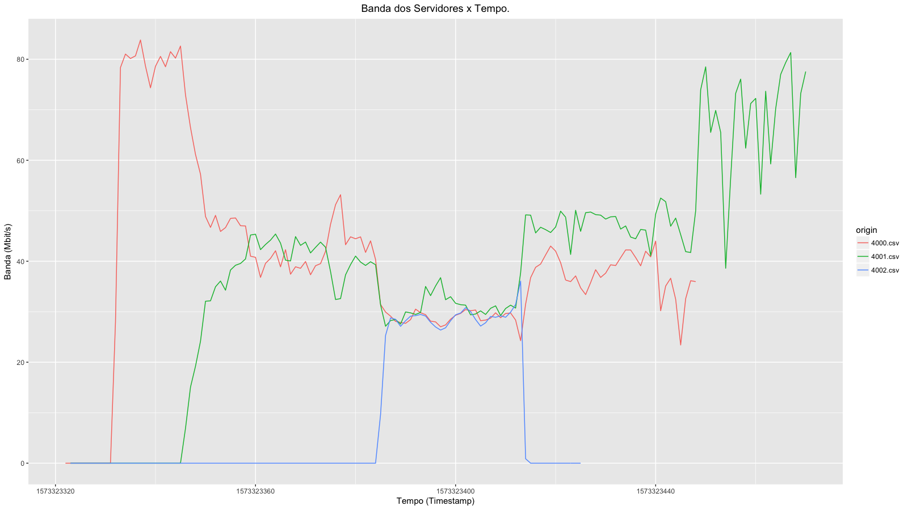

#Objetivo

Criar um programa em TCP que permita analisar equidade do tráfego na rede. O programa deve enviar dados na máxima velocidade possível pela rede (no laboratório é de 1G bit/s). Um parâmetro de entrada deve ser a porta a ser utilizada, e as conexões podem ser feitas de forma par a par (cliente-servidor). A rede deve ser monitorada por alguma ferramenta específica (No Linux o System Monitor, por exemplo. No Windows o Netmeter EVO, por exemplo). O programa deve, obrigatoriamente, gerar um log com a média de tráfego por segundo (em bit/s).

Parte 1: Apresentar gráfico com conexão entre duas máquinas (uma janela de terminal no servidor e uma no cliente).

Parte 2: Expandir a conexão para mais um cliente (duas janelas de terminal no servidor e duas no cliente. Cada cliente x servidor numa porta diferente).

Parte 3: Expandir a conexão para mais um cliente (três janelas de terminal no servidor e três no cliente. Cada cliente x servidor numa porta diferente).

O programa deve ser apresentado ao professor de forma individual em algum momento durante a disciplina até o deadline (intervalo de aulas ou a combinar). O algoritmo deve ser explicado verbalmente, mostrando o código-fonte e o resultado. A linguagem do programa é da escolha do aluno.

#Procedimento

Primeiramente iniciamos uma conexão cliente-servidor na porta 4000, 4001 e 4002 esperando cada conexão se estabilizar para iniciar uma nova. Após os três programas estiverem executando paramos de executar o servidor com a porta 4002 e em seguida o servidor de porta 4000.

#Resultados

```{r, include=FALSE}
library(ggplot2)
library(tidyverse)

files <- list.files("log/", "*.csv", full.names = T)
names(files) <- list.files("log/", "*.csv")

df <- map_df(files, ~read_csv(.), .id = "origin")

df %>% 
    ggplot()+
    aes(x=TIME,y=BAND, color = origin) +
    geom_line()+
    labs(x="Tempo (Timestamp)", y="Banda (Mbit/s)", title="Banda dos Servidores x Tempo.") +
    theme(plot.title = element_text(hjust = 0.5))

ggsave('./server.png', width = 16, height = 9, dpi = 100)
```


 Podemos observar que cada vez que adicionamos um servidor novo, a banda é dividida igualmente, podendo haver algumas ocilações.
